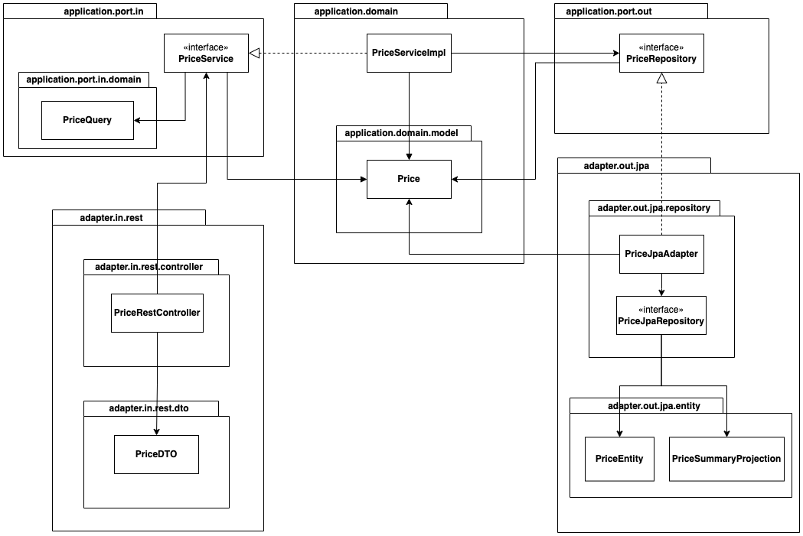
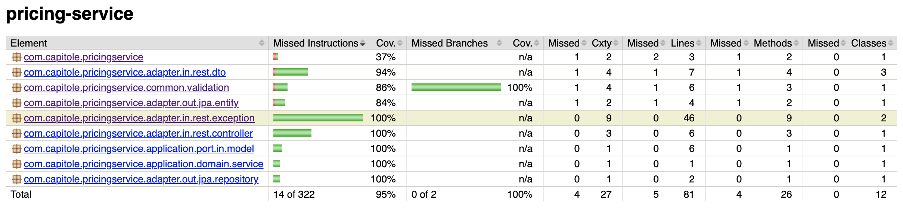

# Pricing-service

# Capitole technical test
Technical test for Capitole, Service to query a product price
# Technological stack

- OS MacOS 14
- Java 21 
- Maven 3.9.6
- Spring Boot 3.2.10
- H2
- JPA 
- Docker
- Jacoco
- Junit 5
- Lombok
- Swagger 
- Intellij IDEA

### Software architecture and patterns
- Hexagonal architecture (ports and adapters)
- SOLID


# Architecture


The solution is based on a hexagonal architecture (ports and adapters).


This diagram illustrates the main components of the architecture. Each section represents a different layer of the architecture, which is divided into ports, adapters, domain. 
Here's a breakdown of the key components:

###  Ports (Input and Output):

#### application.port.in (Input Port):
Contains the interface PriceService, which defines the contract for the application’s domain logic. It's the entry point for external components (like controllers) to interact with the core logic.
#### application.port.out (Output Port):

Contains the interface PriceRepository, which defines how the core business logic interacts with external data sources or systems. It decouples the core logic from persistence logic.

###  Adapters:

#### adapter.in.rest:
This is the REST input adapter. It includes:
PriceRestController: A REST controller that accepts requests HTTP requests, converts them to internal models , and forwards them to the PriceService.

#### adapter.out.jpa:
This is the JPA output adapter. It includes:
PriceJpaAdapter: This is the adapter that implements the PriceRepository interface and bridges the domain logic with the persistence layer.
PriceJpaRepository: An interface for the JPA repository, which is extending from JpaRepository, allowing access to the database.

### Domain:
#### application.domain.model.Price:
This represents the core business model for a Price. This model is used across the application domain logic, adhering to business rules.

PriceServiceImpl:
This class implements the PriceService interface, handling the business logic related to pricing. It interacts with the PriceRepository for data retrieval and manipulation.

### Flow:

- The flow starts from the PriceRestController in the input adapter, which accepts  HTTP requests with the BrandId, ProductId and ApplicationDate, converts it to a PriceQuery, and calls the PriceService to process it.
- The PriceServiceImpl will use the PriceRepository to interact with the persistence  via the PriceJpaAdapter.
- At this point, the PriceJpaAdapter will  make the query to the database through the PriceJpaRepository and return the result to the PriceServiceImpl which will convert it to a PriceR and return it to the PriceRestController
- Finally, the PriceRestController will convert the Price to a PriceDTO and return it to the client.


This architecture follows hexagonal design principles by keeping the core business logic isolated from external concerns, ensuring a clear separation between the domain and the external systems like databases or web interfaces.
This decoupling makes the system more maintainable, testable, and flexible, as changes in external systems or infrastructure do not ripple through the core application. 


# API Description
## GET /api/prices/{brandId}/{productId}
## Parameters
- brandId (path) : ID of the brand
- productId (path): ID of the product
- applicationDate (query): Date of the application in the format YYYY-MM-DD HH:mm:ss

## Response
Media Type: application/json
- HTTP Code 200 - Price found
- HTTP Code 404 - Price/Resource not found
- HTTP Code 400 - Bad Request
- HTTP Code 500 - Internal Server Error

### Example response Body 200 - Price found
```shell
{
    "productId": 35455,
    "brandId": 1,
    "priceList": 1,
    "startDate": "2020-06-14T00:00:00",
    "endDate": "2020-12-31T23:59:59",
    "price": 35.5
}
```
### Example response Body 404 - Price/Resource not found
```
{
"code": "NOT_FOUND",
"message": "Price not found.",
"details": "Price not found for parameters in request"
}
```

# Running the service locally
## Prerequisites
- Java 21 or later
- Maven

## Optional
- Docker
- Make

## Running the service using maven
```shell
mvn spring-boot:run
```

## Running the service using Makefile ( mandatory Docker and Make )
```shell
make up 
```

# Test 
The service has implemented unit tests, integration tests and system tests.
To run tests run any of the following commands:

```shell
mvn test 
``` 
```shell
make test 
```

After running the tests, the coverage report can be found in the target folder. `target/site/jacoco/index.html`



# Test the service
## Locally
Use curl in command line or an application like Postman.
Also, it is possible to test the service using the Swagger UI
```shell
curl --location 'http://localhost:8080/api/prices/1/35455?applicationDate=2020-06-14%2010%3A00%3A00'
```
## Complementary endpoints
- `http://localhost:8080/h2-console `
H2 Console 
- `http://localhost:8080/swagger-ui/index.html `
Swagger Documentation and Try it out 

## Kubernetes - Azure AKS
The service is running in Azure AKS.
To test the service, use curl in command line or an application like Postman.

```shell
curl --location 'http://4.236.214.134/api/prices/1/35455?applicationDate=2020-06-14%2010%3A00%3A00'
```

### Swagger UI:
- `http://4.236.214.134/swagger-ui/index.html`
  Swagger Documentation and Try it out


> **Note:** This a temporary environment to test the service, the cluster is generated with basic configurations and resources using the free tier.
> 
> If the service is not running, please contact me via email so I can bring the service back up.

`# To - Do
- Setup Devops environment ( CI/CD ).
- Implement a feature to use a production database instead of an in-memory database.

`